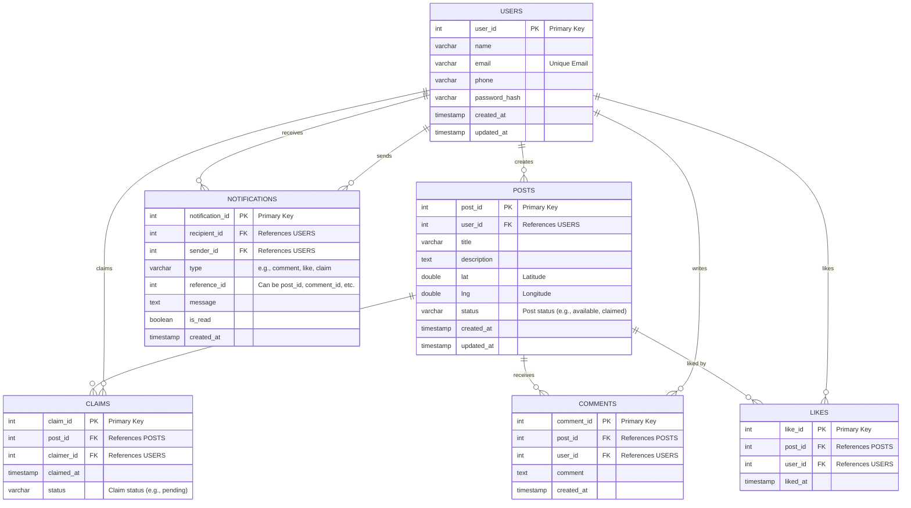

 # FoodWasteManager

FoodWasteManager is a social platform that connects food donors with nearby individuals in need. By enabling donors to post available food resources with an integrated Google Maps feature, we help reduce food waste and build stronger communities.

## Motivation & Goals

- **Motivation:**  
  Reduce food waste and make it easier for communities to share surplus food.
- **Goals:**  
  - Decrease food wastage by connecting donors and recipients.
  - Provide a user-friendly interface for posting and claiming food.
  - Utilize geolocation services for efficient, real-time food sharing.

## Features

- **User Registration & Authentication:**  
  Secure sign-up and login for both donors and recipients.
- **Post Creation:**  
  Donors can create posts that include descriptions, images, and geolocation data.
- **Google Maps Integration:**  
  Enables users to pinpoint the exact location of food donations.
- **Claim Management:**  
  Recipients can claim available posts, and the system tracks the status of each post.
- **Real-Time Notifications:**  
  Alerts users when new posts are available or when their claims are updated.

## Technology Stack

- **Frontend:**  Next.js
- **Backend:**  Node.js
- **Database:**  PostgreSQL
- **Other Tools:** Google Maps API, clear authentication

### ER Diagram

### System Design 

